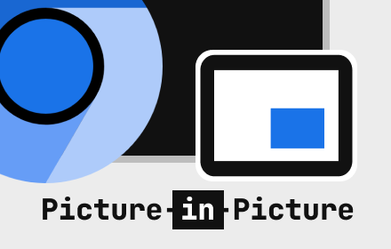
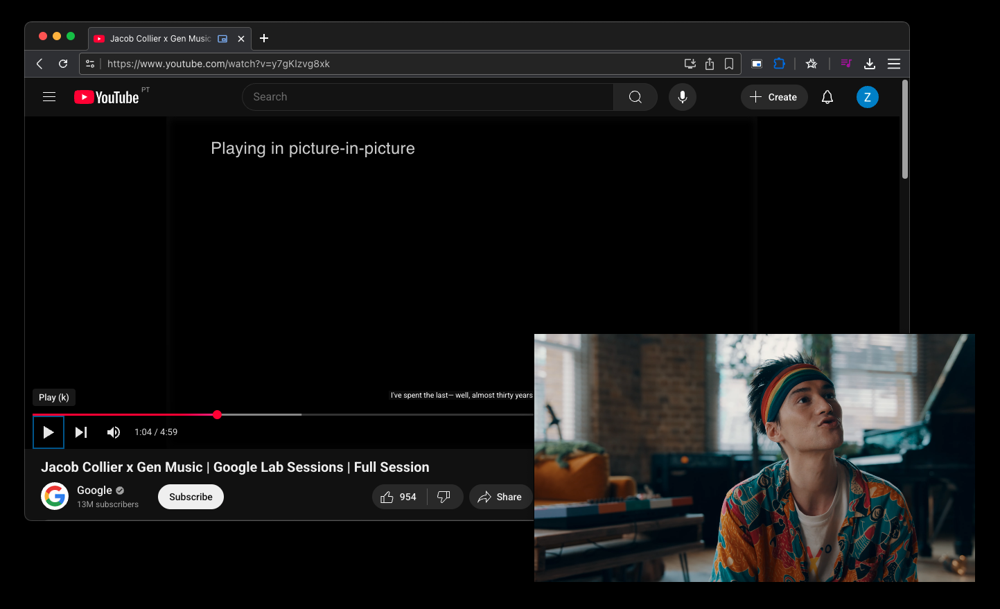

# Picture-in-Picture Viewer

A simple Chromium Extension to demonstrate the [Picture-in-Picture Web API](https://wicg.github.io/picture-in-picture/).

It is a fork of [Google's PIP](https://github.com/GoogleChromeLabs/picture-in-picture-chrome-extension) with some fixes and stripped of Google Analytics tracking.

Get it on the Chrome Web Store at https://chrome.google.com/webstore/detail/picture-in-picture-viewer/kgfcmiijchdkbknmjnojfngnapkibkdh

## Configuration

The keyboard shortcut (defaults to `Alt-P`) can be changed on the Chrome Extension Shortcuts settings page:
`chrome://extensions/shortcuts`
