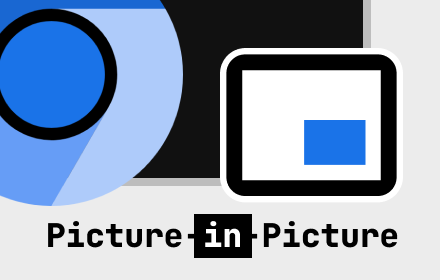
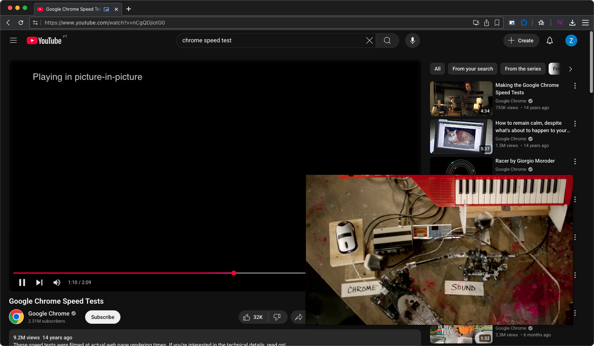

# Picture-in-Picture Viewer

A simple Chromium Extension to demonstrate the [Picture-in-Picture Web API](https://wicg.github.io/picture-in-picture/) in Chromium.

Get it on the Chrome Web Store at https://chrome.google.com/webstore/detail/picture-in-picture-viewer/kgfcmiijchdkbknmjnojfngnapkibkdh

## Configuration

The keyboard shortcut (defaults to `Alt-P`) can be changed on the Chrome Extension Shortcuts settings page:
`chrome://extensions/shortcuts`
